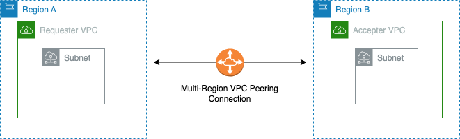

# **Using Terraform to Create an AWS Multi Region VPC Peering**

Hi, Welcome to the second in the VPC Peering Series.

In this edition, you will learn how to create and peer VPCs together that are in different regions. This shows how to create a multi region VPC peering on AWS using terraform.
 
 

## __What is AWS Multi Region VPC Peering?__
Amazon Web Services (AWS) Multi Region Virtual Private Cloud (VPC) peering is a networking feature that allows you to connect two VPCs together in different regions, enabling communication between them as if they were on the same network.
 
 

 
 

## __CONCLUSION__
 
In conclusion Multi Region VPC peering is useful for scenarios where you want to share resources, services, or data securely between separate VPCs in seperate regions, such as connecting development and production environments, sharing databases, or integrating different applications within your AWS infrastructure. It provides a convenient way to build complex multi-tier architectures in a scalable and isolated manner that transcends the AWS region. As shown above, its shows the connection between 2 ec2 instances in different regions connecting with each other over the multi region vpc peering.